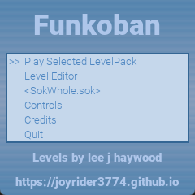
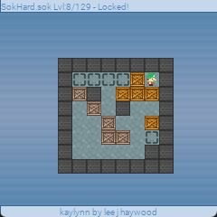
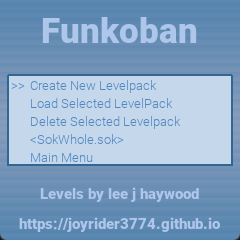
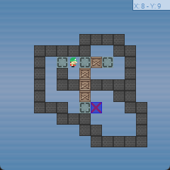

# Funkoban Funkey-s / RG-Nano
   

Funkoban is a remake of the classic sokoban game. 
You as the player need to push boxes to specific locations in the level. 
Once all boxes are pushed to the correct spots the level is finished. 
Funkoban is basically a sokoban engine, it contains all the game rules and has the ability to use level packs. 
It's possible to create your own levelpacks using the built in Level editor. 
Each level pack can also have customized graphics and menu colors. 
The game engine also has an undo system up to 1000 moves. 

This version is a cleanup of my old gp2x version, using open source assets and adapted code

## Screenshots

## Game Features:
- Multiple Levels spread over different (default) level packs (Max 1000 level packs)
- Max 15x15 level size, will filter ascii sets if levels are too big
- Level Editor (Create your own Level Packs)
- Supports ascii (.sok / .txt) level sets
- Autosaves progress
- Reassign Controls

## Playing the Game:
Funkoban Will start up at the main menu, here you can choose the level pack you wish to edit or play by using left and right when the level pack name is selected (it's between "<>" signs).
If you are new to Sokoban i suggest that you play the SokWhole level pack since these are not soo hard to solve. 
When a level pack is loaded either for game play or level editing, the level selector will show up. Here you select what level you wish to edit or play, if it has been unlocked yet.
After you solved a level one extra level will be unlocked. you always have to solve to last unlocked level in order to unlock the next one.

### Level Packs
If you wish to create levels yourself, load up the level editor and create a new level pack. You can choose a name for the levelpack by using up down left right and confirm the name by using A. 
There is a space sign included decrease the selected sign to go to it. Once a new level pack has been created you can then load it, and you will be in the level selector. 
just press Y and start creating your own levels. The level editor will know when a level has been changed,  so it will ask you, 
if you want to save whenever you quit back to the level selector (using escape / select). The level editor will also automatically choose a filename for the levels, you don't need to worry about this. 
You can change the graphics used in your Levels By copying the files from the graphics folder to your level pack folder in the level packs directory, and edit them to your liking. 
It's not necessary to copy over all graphics, if you just wish to change the title screen, then make sure there only exists a titlescreen.png graphics file in your level pack directory. 
You can also customize the main menu colors by editing the colors.txt file using an editor that's capable of showing linux text files. 
The numbers are saved in RGBA format Red, Green, Blue values and the A is for alpha which is a value between 0 and 255, 0 will hide the menu completely whereas 255 will show it without transparency. 
Test it out with a value of for example 100 to see the effects.
Once your level pack is finished you can just zip your level pack directory and release it to the public. They will then have to unzip your level pack in the level packs directory and it will be shown inside the game.

User made levels and packs are saved in the ".sokoban_levelpacks" folder. 
On the windows this folder is located in the same directory as the executable.
In linux or if a HOME environment variable is set it will be located in "$HOME/.sokoban_levelpacks"

### Sok/txt (ascii) Level Packs
This version of sokoban supports .sok and .txt files that define sokoban levels in a text file format. 
There are only a select few of these preinstalled but you can however get extra of such files from the following sites:

* http://sokobano.de/en/levels.php  (use exception to allow http) click the little blue download icons
* https://www.sourcecode.se/sokoban/levels.php click a level pack and click on the little T icon to download a text level pack

## Controls Gamepad (xbox controller)

| Button | Action |
| ------ | ------ |
| A | Confirm in menus, level selector and questions asked, place a part in the level editor |
| B | Quit to title screen on the level selector, Quit to level selector in game and level editor mode. |
| Y | In Level editor Mode, Create a new level when being in the level selector. In the level editor itself erase all parts from the screen. Inside the game itself restart the level |
| X	| In the level editor, center the level on screen |
| D-PAD | move main player |
| SELECT | Show statistics during a game. Hide the part position/grid in the level editor |
| L | At the level Selector decrease selected level with 5, During game play select the previous music. In the level editor select previous part |
| R | At the level Selector increase selected level with 5, During game play select the next music. In the level editor select next part. |
| START | Test level when being in the level editor, go back to level editor after testing, Restart the current level |

## Credits
Game is an adaptation from the gp2x version i (willems davy, aka joyrider3774) initially made many years ago

### Libraries
- SDL
- SDL_MIXER
- SDL_TTF
- SDL_GFX
- SDL_IMAGE

### Fonts
- Roboto-Black by google
- SpaceMono-Regular by google
- SpaceMono-Regular by google

### Graphics
- wall: [1001.com](https://opengameart.org/content/sokoban-pack) - [Attribution-ShareAlike 3.0 Unported](https://creativecommons.org/licenses/by-sa/3.0/)
- floor: [Kenney Sokoban tiles](https://opengameart.org/content/sokoban-100-tiles) - [CC0 1.0 Universal](https://creativecommons.org/publicdomain/zero/1.0/)
- player: [Kenney Sokoban tiles](https://opengameart.org/content/sokoban-100-tiles) - [CC0 1.0 Universal](https://creativecommons.org/publicdomain/zero/1.0/)
- box: [SpriteAttack boxes and crates](https://opengameart.org/content/boxes-and-crates-svg-and-pngs) - [CC0 1.0 Universal](https://creativecommons.org/publicdomain/zero/1.0/)

### Music
- "Puzzle Game 3" by Eric Matyas Soundimage.org - Creative Commons Attribution 4.0 International License - https://opengameart.org/content/puzzle-game-3
- "title" by migfus20 - Creative Commons Attribution 4.0 International License - https://opengameart.org/content/weird-shop-gypsy-guitar
- "periwinkle" by axtoncrolley - Attribution-ShareAlike 3.0 Unported - https://opengameart.org/content/happy-go-lucky-puzzle
- "041415calmbgm" by syncopika - Attribution 3.0 Unported - https://opengameart.org/content/calm-bgm

### Sound
- "stageend" by Fupi - CC0 1.0 Universal - https://opengameart.org/content/win-jingle
- "select" - created by ViRiX Dreamcore (David McKee) soundcloud.com/virix - Attribution 3.0 Unported - https://opengameart.org/content/ui-and-item-sounds-sample-1
- "back" - created by ViRiX Dreamcore (David McKee) soundcloud.com/virix - Attribution 3.0 Unported - https://opengameart.org/content/ui-and-item-sounds-sample-1
- "error" - created by ViRiX Dreamcore (David McKee) soundcloud.com/virix - Attribution 3.0 Unported - https://opengameart.org/content/ui-failed-or-error
- "menu" - created by Tim Mortimer - Attribution 3.0 Unported -  https://opengameart.org/content/4-sci-fi-menu-sounds
- "move " - created by me (willems davy) using BXFR - feel free to use

### Level (pack) Authors
The Game uses Levels created by different Authors almost all levelpacks are loaded through level set sok files. 

I used the sok files available for download on http://sokobano.de/en/levels.php as they contained the Authors as well as the title of the levels and comments in the files.
I implemented a parser for these levels so they can now be used with the game.

Back when i initially created the game for the gp2x i had my own format and this is still used when people create their own levels (inside the game). 

Below you can find all authors and details for the different .sok files that is supplied with this game.

#### 696.sok
- Author: Dries de Clercq

#### Minicosmos.sok
- Author: Aymeric du Peloux
- Homepage:  https://aymericdupeloux.wixsite.com/sokoban

#### Microcosmos.sok
- Author: Aymeric du Peloux
- Homepage:  https://aymericdupeloux.wixsite.com/sokoban

#### Nabokosmos.sok
- Author: Aymeric du Peloux
- Homepage:  https://aymericdupeloux.wixsite.com/sokoban

#### Picokosmos.sok
- Author: Aymeric du Peloux
- Homepage:  https://aymericdupeloux.wixsite.com/sokoban

#### Cosmopoly.sok
- Author: Aymeric du Peloux
- Homepage:  https://aymericdupeloux.wixsite.com/sokoban

#### Myriocosmos.sok
- Author: Aymeric du Peloux
- Homepage:  https://aymericdupeloux.wixsite.com/sokoban

#### Cosmonotes.sok
- Author: Aymeric du Peloux
- Homepage:  https://aymericdupeloux.wixsite.com/sokoban

#### GRIGoRusha 2001.sok
- Author: Evgeniy Grigoriev (GRIGoRusha)
- Homepage:  http://grigr.narod.ru/

#### GRIGoRusha 2002.sok
- Author: Evgeniy Grigoriev (GRIGoRusha)
- Homepage:  http://grigr.narod.ru/

#### GRIGoRusha Remodel Club.sok
- Author: Evgeniy Grigoriev (GRIGoRusha)
- Homepage:  http://grigr.narod.ru/

#### GRIGoRusha Special.sok
- Author: Evgeniy Grigoriev (GRIGoRusha)
- Homepage:  http://grigr.narod.ru/

#### GRIGoRusha Star.sok
- Author: Evgeniy Grigoriev (GRIGoRusha)
- Homepage:  http://grigr.narod.ru/

#### GRIGoRusha Sun.sok
- Author: Evgeniy Grigoriev (GRIGoRusha)
- Homepage:  http://grigr.narod.ru/

#### SokEvo.sok
- Author: Lee J Haywood
- Homepage:  https://leehaywood.org/games/sokoban/

#### SokHard.sok
- Author: Lee J Haywood
- Homepage:  https://leehaywood.org/games/sokoban/

#### SokWhole.sok
- Author: Lee J Haywood
- Homepage:  https://leehaywood.org/games/sokoban/

#### LOMA.sok
- Author: Lee J Haywood
- Homepage:  https://leehaywood.org/games/sokoban/

#### Erim Sever Collection.sok
- Author: Erim Sever
- Homepage: https://web.archive.org/web/20191029215423/http://www.erimsever.com/e_sokoban.htm
